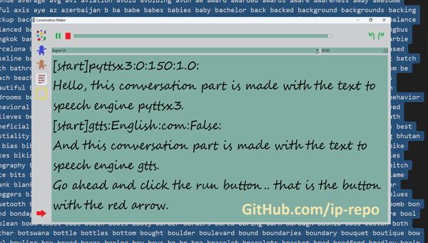

# conversation-maker: turn text conversations to speech.

</img>

A PySide6 text to speech program that allow user to create speech conversations from text conversations.
<hr>

### How to use:
This program use a few python modules so make sure to install them.
```console
git clone https://github.com/ip-repo/conversation-maker.git
python -m venv cm-venv #create a virtual environment 
cm-venv\Scripts\activate #activate venv
#required modules
pip install PySide6 #version: 6.6.2
pip install pyaudio #version 0.2.14
pip install pydub #version: 0.25.1
pip install gtts  #version: 2.5.1
pip install pyttsx3 #version 2.90
pip install requests #version: 2.31
cd conversation-maker #get into the project directory
python run.py

```
Or
```console
git clone https://github.com/ip-repo/conversation-maker.git
python -m venv cm-venv #create a virtual environment 
cm-venv\Scripts\activate #activate venv
cd conversation-maker #get into the project directory
pip install -r requirements.txt
python run.py

```
